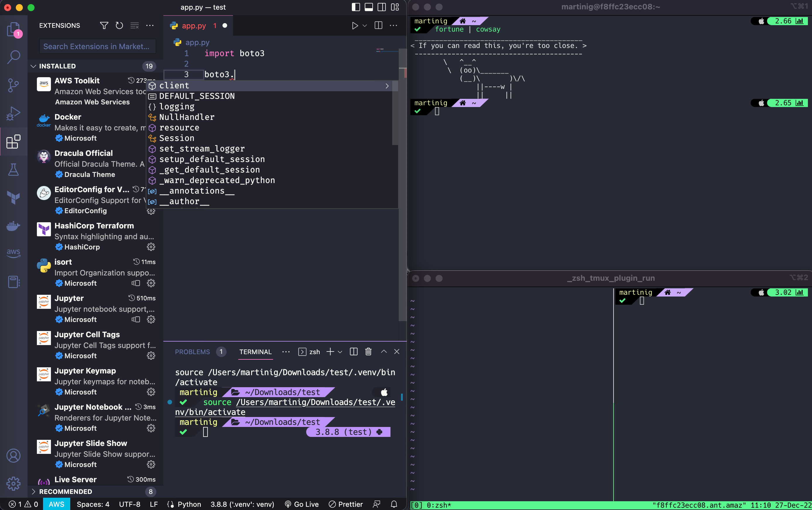

# My Env



## Setting Up

> :warning: It is going to install more than **200** packages. Check [brew packages](brew/packages.txt) before to review what you want.

1. Open terminal and execute script

```bash
# install homebrew
/bin/bash -c "$(curl -fsSL https://raw.githubusercontent.com/Homebrew/install/HEAD/install.sh)"
# install packages and preferences
./install.sh
```

### iTerm2

1. Open iTerm

```bash
open -a iterm
```

2. Open profiles <kbd>command</kbd>+<kbd>O</kbd> and click on **Edit Profiles**
3. Click on **+** to add a New Profile
4. Click on **Other Actions** and **Import JSON Profiles**
5. Select the [iterm/profile.json](iterm/profile.json)
6. Set as _default_
7. Reopen iTerm

## References

- Oh-my-zsh: https://ohmyz.sh/
- PowerLevel10K: https://github.com/romkatv/powerlevel10k
- Nerd Fonts: https://www.nerdfonts.com/
- Fira Code Font: https://github.com/tonsky/FiraCode
- Mac oh-my-zsh: https://blog.rocketseat.com.br/terminal-com-oh-my-zsh-spaceship-dracula-e-mais/
- Windows oh-my-zsh: https://dev.to/erickrock80/pt-br-instalando-oh-my-zsh-no-windows-terminal-3a8l
